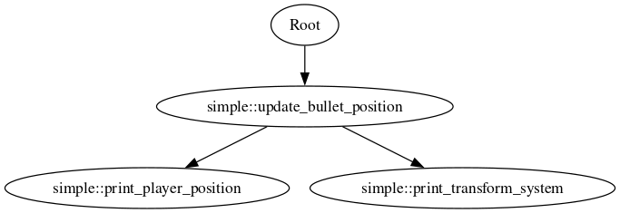

# The KECS Entity Component System

This is my spin on developing a (proper) Entity Component System, inspired by [Bevy](https://bevyengine.org/)'s ECS.

The world is composed of Entities, which act are integers associated with Components: a component is just a plain struct
with some data, on which Systems operate.

e.g from the 'simple' example
. Define some components
```rust
#[derive(Debug)]
struct EntityName(String);

struct Bullet {
    direction: [f32; 2],
}

// A struct without any members is called a tag structure
struct Player;

#[derive(Default, Debug)]
struct Transform {
    position: [f32; 2],
}
```

2. Define how the systems interact with the components

```rust

// A query is an iterator over the entities with the specified components
fn update_bullet_position(query: Query<(&Bullet, &mut Transform)>) {
    for (bullet, transform) in query.iter() {
        transform.position[0] += bullet.direction[0];
        transform.position[1] += bullet.direction[1];
    }
}

// You can also get the entity itself
fn print_transform_system(query: Query<(Entity, &EntityName, &Transform)>) {
    for (entity, entity_name, transform) in query.iter() {
        println!(
            "Transform of entity {entity:?} with name '{}' at {:?}",
            entity_name.0, transform
        );
    }
}

fn print_player_position(query: Query<(&Player, Entity, &EntityName, &Transform)>) {
    for (_, entity, entity_name, transform) in query.iter() {
        println!(
            "Transform of player {entity:?} with name '{}' at {:?}",
            entity_name.0, transform
        );
    }
}
```

3. Create a world and spawn the entities
```rust
 let mut world = World::new();

    {
        let bullet_entity = world.new_entity();
        world.add_component(
            bullet_entity,
            Bullet {
                direction: [1.0, 0.0],
            },
        );
        world.add_component(bullet_entity, Transform::default());
        world.add_component(bullet_entity, EntityName("Bullet 0".to_owned()));
    }

    {
        let bullet_entity = world.new_entity();
        world.add_component(
            bullet_entity,
            Bullet {
                direction: [-1.0, 0.0],
            },
        );
        world.add_component(bullet_entity, Transform::default());
        world.add_component(bullet_entity, EntityName("Bullet 1".to_owned()));
    }

    {
        let player_entity = world.new_entity();
        world.add_component(player_entity, Player);
        world.add_component(player_entity, Transform::default());
        world.add_component(player_entity, EntityName("Player".to_owned()));
    }
```

4. Schedule the systems for execution
```rust
    // Use a label to group systems together
    let example = "example";
    world.add_system(example, update_bullet_position);
    world.add_system(example, print_transform_system);
    world.add_system(example, print_player_position);

```

5. Run the systems
```rust

    // In real code this should belong in an event loop
    for i in 0..3 {
        println!("Frame {i}");
        world.update(example);
        println!("\n\n");
    }
```

The execution graph for the sample above is the following



# FAQ
### Why would i use this ECS over more established ones?
Don't

### Why create an ECS then?
I was curious on how ECSs work, and i wanted to challenge myself on implementing my own ECS for my homegrown game engine.

Also, _i made it for the keks_

# Resources used
* [Michele 'skypjack' Caini's blog](https://skypjack.github.io/), which describes the choices he made behind his EnTT ECS;
* [Bevy's ECS](https://github.com/bevyengine/bevy/tree/main/crates/bevy_ecs), which is an actual, production ready, ECS;
* [Ratysz's 'ECS scheduler thoughts' post](https://ratysz.github.io/article/scheduling-1/)